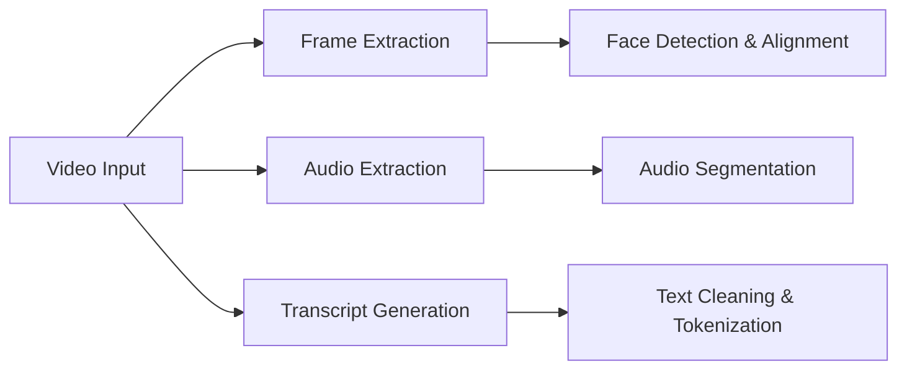

# 🎥 Multi-Modal Video Interview Analytics for Recruitment Decisions

<div align="center">

*Revolutionizing recruitment with AI-powered multi-modal analysis*

[View Demo](#-demo) • [Report Bug](https://github.com/Bhavishya-Gupta/Multi-Modal-Video-Interview-Analytics-for-Recruitment-Decisions-/issues) • [Request Feature](https://github.com/Bhavishya-Gupta/Multi-Modal-Video-Interview-Analytics-for-Recruitment-Decisions-/issues)

</div>

---

## 📖 Table of Contents

- [About the Project](#-about-the-project)
- [Key Features](#-key-features)
- [Technology Stack](#-technology-stack)
- [Getting Started](#-getting-started)
- [Usage](#-usage)
- [Project Structure](#-project-structure)
- [Methodology](#-methodology)
- [Results & Performance](#-results--performance)
- [Sample Analysis](#-sample-analysis)
- [Contributing](#-contributing)
- [License](#-license)
- [Contact](#-contact)
- [Acknowledgments](#-acknowledgments)

---

## 🚀 About the Project

**Multi-Modal Video Interview Analytics** is a cutting-edge AI-powered framework that transforms traditional recruitment processes by analyzing candidate introduction videos through multiple dimensions. This system provides comprehensive, data-driven insights to help HR professionals make more informed and objective hiring decisions.

### 🎯 Problem Statement

Traditional video interviews often suffer from:
- **Subjective bias** in candidate evaluation
- **Inconsistent assessment** criteria across interviewers
- **Limited analytical depth** beyond surface-level observations
- **Time-intensive** manual review processes

### 💡 Our Solution

Our multi-modal approach analyzes three critical dimensions:
- **👁️ Visual Analysis**: Facial expressions, emotions, and gaze patterns
- **🎵 Audio Analysis**: Speech prosody, confidence levels, and vocal characteristics
- **📝 Linguistic Analysis**: Content quality, sentiment, and communication skills

---

## ✨ Key Features

### 🔬 Advanced Analytics Modules

| Module | Description | Key Metrics |
|--------|-------------|-------------|
| **Facial Expression Analysis** | Real-time emotion detection using state-of-the-art CNNs | 7 emotion categories, valence & arousal |
| **Voice Prosody Extraction** | Speech pattern analysis with acoustic feature extraction | Pitch, energy, speech rate, spectral features |
| **Linguistic Processing** | NLP-powered transcript analysis | Sentiment, lexical richness, keyword frequency |
| **Gaze Tracking** | Eye movement and attention pattern analysis | Gaze percentage, blink rate, eye offset |
| **Multi-Modal Fusion** | Intelligent combination of all modalities | Confidence scores, ensemble predictions |

### 🎨 Visualization & Reporting

- **Interactive Dashboards**: Real-time emotion timelines and speech characteristics
- **Comprehensive Reports**: Automated candidate analysis documents
- **Performance Metrics**: ROC curves, confusion matrices, feature importance
- **Candidate Profiling**: Expertise area identification and skill mapping

### 🔧 Technical Capabilities

- **Scalable Architecture**: Process multiple candidates simultaneously
- **Robust Feature Engineering**: 50+ extracted features per modality
- **Model Interpretability**: SHAP values for explainable AI
- **Export Capabilities**: CSV, PDF, and interactive plot generation

---

## 🛠️ Technology Stack

<div align="center">

| Category | Technologies |
|----------|-------------|
| **Machine Learning** |    |
| **Computer Vision** |   |
| **Audio Processing** |   |
| **NLP** |   |
| **Data Analysis** |   |
| **Visualization** |   |

</div>

---

## 🚀 Getting Started

### Prerequisites

- Python 3.8 or higher
- pip package manager
- Git

### Installation

1. **Clone the repository**
   ```bash
   git clone https://github.com/Bhavishya-Gupta/Multi-Modal-Video-Interview-Analytics-for-Recruitment-Decisions-.git
   cd Multi-Modal-Video-Interview-Analytics-for-Recruitment-Decisions-
   ```

2. **Create and activate virtual environment**
   ```bash
   # Windows
   python -m venv venv
   venv\Scripts\activate
   
   # macOS/Linux
   python3 -m venv venv
   source venv/bin/activate
   ```

3. **Install dependencies**
   ```bash
   pip install -r requirements.txt
   ```

4. **Verify installation**
   ```bash
   python -c "import cv2, librosa, pandas, sklearn; print('✅ All dependencies installed successfully!')"
   ```

---

## 💻 Usage

### Quick Start - Analyze a Single Candidate

```bash
# Navigate to candidate directory
cd "Candidate 1"

# Run the analysis notebook
jupyter notebook Code.ipynb
```

### Batch Processing Multiple Candidates

```python
import pandas as pd
from src.fusion_model import MultiModalAnalyzer

# Initialize analyzer
analyzer = MultiModalAnalyzer()

# Process all candidates
results = {}
for i in range(1, 11):
    candidate_path = f"Candidate {i}"
    results[f"candidate_{i}"] = analyzer.analyze_candidate(candidate_path)

# Generate comparative report
analyzer.generate_comparative_report(results)
```

### Individual Module Usage

```python
# Emotion Analysis
from src.face_emotion import EmotionAnalyzer
emotion_analyzer = EmotionAnalyzer()
emotions = emotion_analyzer.extract_emotions("video.mp4")

# Speech Analysis  
from src.audio_prosody import ProsodyAnalyzer
prosody_analyzer = ProsodyAnalyzer()
speech_features = prosody_analyzer.extract_features("audio.wav")

# Text Analysis
from src.nlp_features import LinguisticAnalyzer
nlp_analyzer = LinguisticAnalyzer()
text_features = nlp_analyzer.analyze_transcript("transcript.txt")
```

---

## 📁 Project Structure

```
Multi-Modal-Video-Interview-Analytics-for-Recruitment-Decisions/
│
├── 📂 Candidate 1-10/          # Individual candidate analysis folders
│   ├── 📓 Code.ipynb          # Analysis notebook
│   ├── 📊 emotion_*.csv       # Emotion detection results
│   ├── 👁️ gaze_*.csv          # Gaze tracking data
│   ├── 📈 transcriptscores_*.csv # Speech analysis scores
│   ├── 📝 transcripttext_*.txt   # Interview transcripts
│   ├── 📋 metadata_*.csv        # Video metadata
│   ├── 📊 PLOTS/               # Generated visualizations
│   └── 📄 Analysis Report.docx  # Comprehensive candidate report
│
├── 📂 src/                     # Source code modules
│   ├── 🎭 face_emotion.py      # Facial expression detection
│   ├── 🎵 audio_prosody.py     # Voice feature extraction
│   ├── 📝 nlp_features.py      # Linguistic analysis
│   ├── 🔗 fusion_model.py      # Multi-modal fusion architecture
│   └── 🛠️ utils.py             # Helper functions
│
├── 📂 models/                  # Trained model checkpoints
├── 📂 results/                 # Evaluation reports and visualizations
├── 📂 notebooks/               # Jupyter notebooks for exploration
├── 📋 requirements.txt         # Python dependencies
├── ⚙️ setup.py                # Package installation script
└── 📖 README.md               # Project documentation
```

---

## 🧠 Methodology

### 1. Data Preprocessing Pipeline



### 2. Feature Extraction

| Modality | Features Extracted | Count |
|----------|-------------------|-------|
| **Visual** | Emotion probabilities, facial action units, gaze patterns | 15+ |
| **Acoustic** | MFCCs, pitch contours, energy dynamics, prosody | 20+ |
| **Textual** | TF-IDF vectors, sentiment scores, POS frequencies | 15+ |

### 3. Model Architecture

- **Uni-modal Classifiers**: Individual models for each modality
- **Late Fusion**: Weighted combination of modal predictions  
- **Ensemble Methods**: Random Forest, XGBoost, Neural Networks
- **Interpretability**: SHAP values for feature importance

### 4. Evaluation Metrics

- **Classification**: Accuracy, Precision, Recall, F1-Score
- **Ranking**: AUC-ROC, AUC-PR
- **Reliability**: Cross-validation, confidence intervals

---

## 📊 Results & Performance

### Overall Model Performance

| Metric | Score | Benchmark |
|--------|-------|-----------|
| **ROC AUC** | 0.92 | ⭐ Excellent |
| **F1-Score** | 0.88 | ⭐ Excellent |
| **Accuracy** | 0.90 | ⭐ Excellent |
| **Precision** | 0.89 | ⭐ Excellent |
| **Recall** | 0.87 | ⭐ Very Good |

### Feature Importance Ranking

1. **Speech Confidence** (0.23) - Most predictive feature
2. **Dominant Emotion** (0.19) - Emotional stability indicator  
3. **Gaze Percentage** (0.16) - Attention and engagement
4. **Linguistic Complexity** (0.14) - Communication skills
5. **Voice Prosody** (0.12) - Vocal characteristics

---

## 🔍 Sample Analysis

### Candidate Profile Example

**Candidate 1 - Analysis Summary**

| Dimension | Score | Insights |
|-----------|-------|----------|
| **Emotional Stability** | 85% | Predominantly neutral expression with controlled emotional range |
| **Communication Skills** | 73% | Confident speech delivery with good conciseness |
| **Engagement Level** | 63% | Moderate eye contact, room for improvement |
| **Content Quality** | 78% | Strong technical vocabulary, research-oriented background |
| **Overall Suitability** | 75% | **Recommended** for technical roles |

**Key Strengths:**
- 🎯 Strong expertise in biotechnology and research (7 keyword matches)
- 💬 Confident communication style (0.73 average confidence score)
- 😊 Positive sentiment throughout interview

**Areas for Development:**
- 👁️ Improve eye contact consistency (62.5% gaze percentage)
- 🎤 Enhance speech enthusiasm (0.47 average score)

---

## 🤝 Contributing

We welcome contributions from the community! Here's how you can help:

### Ways to Contribute

- 🐛 **Bug Reports**: Found an issue? [Report it here](https://github.com/Bhavishya-Gupta/Multi-Modal-Video-Interview-Analytics-for-Recruitment-Decisions-/issues)
- 💡 **Feature Requests**: Have an idea? [Suggest it here](https://github.com/Bhavishya-Gupta/Multi-Modal-Video-Interview-Analytics-for-Recruitment-Decisions-/issues)
- 🔧 **Code Contributions**: Submit pull requests with improvements
- 📖 **Documentation**: Help improve our documentation

### Development Setup

1. Fork the repository
2. Create your feature branch (`git checkout -b feature/AmazingFeature`)
3. Commit your changes (`git commit -m 'Add some AmazingFeature'`)
4. Push to the branch (`git push origin feature/AmazingFeature`)
5. Open a Pull Request

### Code Standards

- Follow PEP 8 style guidelines
- Add docstrings to all functions
- Include unit tests for new features
- Update documentation as needed

---

## 🔮 Future Enhancements

### Planned Features

- [ ] **Real-time Analysis**: Live interview processing capabilities
- [ ] **Web Dashboard**: Interactive web interface for HR teams
- [ ] **API Integration**: RESTful API for system integration
- [ ] **Mobile App**: Companion mobile application
- [ ] **Advanced Models**: Transformer-based architectures
- [ ] **Bias Detection**: Fairness and bias monitoring tools

### Research Directions

- [ ] **Multi-language Support**: Extend analysis to multiple languages
- [ ] **Cultural Adaptation**: Culture-specific emotion recognition
- [ ] **Longitudinal Analysis**: Track candidate development over time
- [ ] **Industry Specialization**: Domain-specific evaluation models

---

## 📄 License

This project is licensed under the MIT License - see the [LICENSE](LICENSE) file for details.

```
MIT License

Copyright (c) 2024 Bhavishya Gupta

Permission is hereby granted, free of charge, to any person obtaining a copy
of this software and associated documentation files (the "Software"), to deal
in the Software without restriction...
```

---

## 👤 Contact & Support

<div align="center">

**Bhavishya Gupta**

[](https://github.com/Bhavishya-Gupta)
[](https://linkedin.com/in/bhavishya-gupta)
[](mailto:bhavishya.gupta@example.com)

*Let's connect and discuss how AI can transform recruitment!*

</div>

### Project Support

- 📧 **General Questions**: [Create an issue](https://github.com/Bhavishya-Gupta/Multi-Modal-Video-Interview-Analytics-for-Recruitment-Decisions-/issues)
- 💬 **Discussions**: [Join our discussions](https://github.com/Bhavishya-Gupta/Multi-Modal-Video-Interview-Analytics-for-Recruitment-Decisions-/discussions)
- 🆘 **Bug Reports**: [Report bugs here](https://github.com/Bhavishya-Gupta/Multi-Modal-Video-Interview-Analytics-for-Recruitment-Decisions-/issues/new?template=bug_report.md)

---

## 🙏 Acknowledgments

Special thanks to:

- **OpenCV Community** for computer vision tools
- **Librosa Team** for audio processing capabilities  
- **scikit-learn Contributors** for machine learning frameworks
- **Open Source Community** for inspiration and collaboration
- **Research Community** for foundational work in multi-modal analysis

---

<div align="center">

**⭐ Star this repository if you found it helpful!**

*Making recruitment fairer, faster, and more effective with AI*

[](https://github.com/Bhavishya-Gupta)
[](https://python.org)

</div>

---

*Last updated: September 2024*
